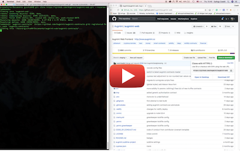

# Augmint Web Frontend - development environment

## Install

These instructions are about the dev environment for frontend development. For contract development see [augmint-contracts repo](https://github.com/Augmint/augmint-contracts)

### OSX / Linux

1.  [Git](https://git-scm.com/download)
1.  Install [nodejs](https://nodejs.org/en/download/)  
    NB: check supported `node` version in [package.json](../package.json)

    or install nodejs with [n node version manager](https://github.com/tj/n):

    ```
    npm install -g n
    n <node version, eg: 10.15.3>
    ```

1.  Install yarn if you don't have it: `npm install -g yarn@<yarn version, e.g. 1.15.2>`  
    NB: check required `yarn` version in [package.json](../package.json)
1.  [Docker cli](https://hub.docker.com/search/?type=edition&offering=community) - Optional but required for running tests
1.  ```
    git clone https://github.com/Augmint/augmint-web.git
    cd augmint-web
    yarn install
    ```

### Windows

_Note: windows install was not tested since a while, update on it is welcome_

1.  [Git Bash](https://git-for-windows.github.io/)
1.  [Git](https://git-scm.com/download) (if you haven't installed it as part of Git Bash in previous step)
1.  [nodejs](https://nodejs.org/en/download/) NB: check supported node version in [package.json](../package.json)

    or install nodejs with [Node Version Manager(NVM)](https://github.com/coreybutler/nvm-windows/releases):

    ```
    nvm install <node version number, eg: 10.15.3>
    nvm use 10.15.3
    ```

1.  Install yarn if you don't have it: `npm install -g yarn@<yarn version, e.g. 1.15.2>` NB: check required yarn version in [package.json](../package.json)
1.  If you want to run on local test blockchain (eg. for tests) then Install [docker cli](https://hub.docker.com/search/?type=edition&offering=community)
1.  in Git bash:
    ```
    git clone https://github.com/Augmint/augmint-web.git
    cd augmint-web
    yarn install
    ```

## Launch

### Update to latest augmint-web

```
git pull
yarn install # if there were any node package changes in packages.json
```

### Start & stop ganache-cli (formerly testrpc) - Optional but required for tests

- `yarn ganache:start`
- `yarn ganache:stop`

### Launch local dev server

`yarn start`

_NB: If you are using Metamask on local chain (e.g. ganache in docker) and you restart the local chain then your consecutive transactions will fail with [`Invalid nonce` error](https://github.com/MetaMask/metamask-extension/issues/1999). You will need to [reset your account in Metamask](http://metamask.helpscoutdocs.com/article/36-resetting-an-account)._

## Tests

### Jest only

```
yarn test
```

### FrontEnd - E2E

- interactive: `yarn cypress:open`
- command line: `yarn cypress:run`

## Non ganache launches/deploys

See [augmint-contracts repo](https://github.com/Augmint/augmint-contracts)

## Etc.

An outdated video of local dev install:

[](https://www.youtube.com/watch?v=agu5LxOcy1c)
